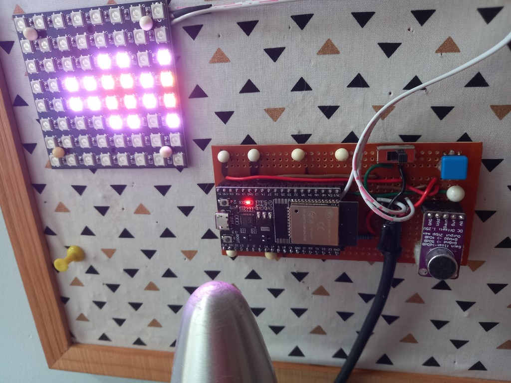

# VU Meter with 8x8 RGB graphics

This project is a VU meter that uses an 8x8 RGB LED matrix to display the volume level of an audio signal. The project uses an ESP32  to sample analog audio signal and drive the LED matrix.

There are various modes that can be selected using the button on the ESP32.

## Notes

Comment out all code in .pio\libdeps\esp-wrover-kit\EasyButton\src\EasyButtonTouch.h to compile on esp32.

